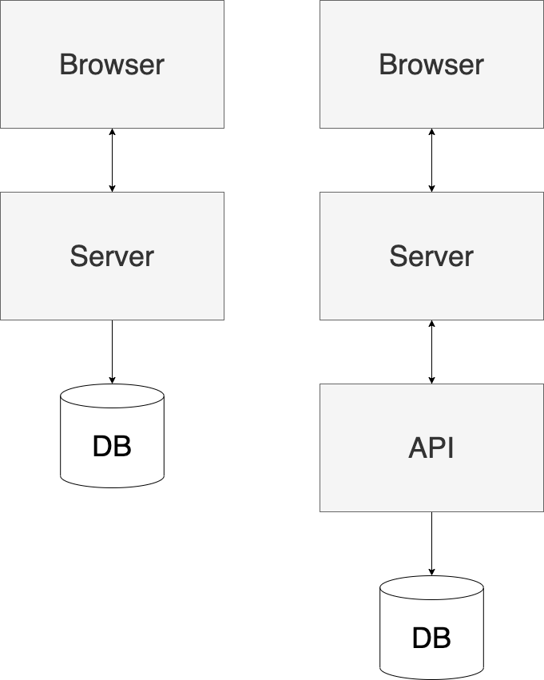
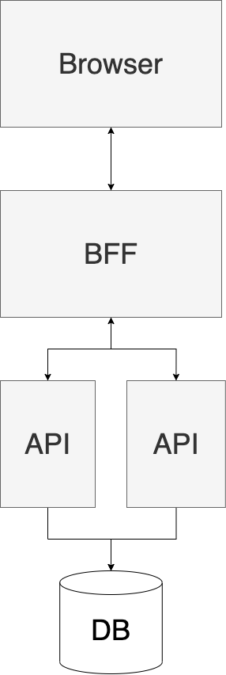

# Webシステムアーキテクチャの歴史[私見] {#history-of-Web-system-architecture}

BrowserとServerだけの構成というシンプルなWebシステムアーキテクチャだ。
Serverから静的コンテンツを返すだけや、CGIを使った動的コンテンツを返すこともできる。

データベースが登場。
Serverから直接データベースを参照する構成や、データベースからAPIを提供する構成がある。
前者は、直接参照するためレスポンスタイムが後者よりも短い。
後者は、APIというインタフェースを挟むことで、データベースの変更が前者よりも容易。

**レスポンスタイム短縮する常套手段** として、**キャッシュレイヤ** を挟むことである。
たとえば、APIとデータベースの間にキャッシュサーバを置くことで、大幅にレスポンスタイムを短縮することが期待できる。
しかし、キャッシュは麻酔であり、多用は厳禁である。なぜなら、さまざまな副作用があるからだ。
副作用の1つに、データ鮮度の低下が見込まれる。キャッシュは用法用量を守ることが大切だ。

APIが複数登場すると、APIをまとめるレイヤが必要となる。
そこで、**[BFF（Backend For Frontends）](https://philcalcado.com/2015/09/18/the_back_end_for_front_end_pattern_bff.html)** というレイヤが登場する。

<!-- textlint-disable -->

<!-- textlint-enable -->

これは、文字どおりフロントエンドのためのバックエンドである。
BFFの機能例として、データをフロントエンド向けに加工したり、HTMLを構築したりする。
フロントエンドでは、UI/UXに興味・関心がある。**UI/UXを表現するデータは、ビジネスロジックを返却するAPIだけでは不十分** である。
複数のAPIより取得したデータをUI/UX向けに加工してフロントエンドに提供することが多い。
ブラウザからBFFまでをフロントエンドとし、BFFより後ろをバックエンドとする。
BFFにより、フロントエンドとバックエンドの境界が明確になる。

バックエンドは、 **[マイクロサービス化](https://martinfowler.com/articles/microservices.html)** に進むケースがある。

<!-- textlint-disable -->

<!-- textlint-enable -->

マイクロサービスという単語を出すならば、モノリスという単語が対比としてよく挙げられる。
モノリスとは、一枚岩という意味で解釈されることが多い。
モノリスなアプリケーションとは、機能的に区別できるサービスすべてが一枚のコンポーネントにまとまっていることである。
それのメリットは、次のような点があると考えている。

* 開発が容易
  * 依存する機能がすべて含まれているため
    * 大規模なシステムになると、設計次第で開発が困難になる
* トラブルシュートが簡単
  * 1つのコンポーネントにすべてのログが記録されているため
* レイテンシが小さい
  * 外部通信が少ないため

モノリスなアプリケーションにもデメリットが2つあると考えている。

1つ目は、システム規模が拡大するにつれて、**開発サイクルが伸びること**だ。
その結果、**ユーザへの価値提供が遅くなってしまう** 。
<!-- textlint-disable -->
理由としては、開発者側の負担である。
<!-- textlint-enable -->
さまざまな機能を1つのコンポーネントに含めるということは、開発者はそれを理解しなければならない。
そのコストは、規模が拡大するにつれて、増大する。
その問題をモノリスアプリケーションで解決する1手段として、モジュールを適切に分離することだ。
モジュラモノリスアーキテクチャが、まさにそれだ。

2つ目は、**システムや組織的なスケーラビリティ性がボトルネック** になることだ。
サービスが成長すると、それに伴いシステムや組織もスケールしなければならない。
しかし、モノリスなアプリケーションでは、**スケールのボトルネック** となってしまう。

システム的な例えとして、ECサイトのモノリスアプリケーションの中で、検索機能の負荷が高くなったする。
その場合、サーバの改善（スケールアウトorスケールアップ）をするか、アプリケーションチューニングをするかなどになる。
本来は、**検索機能だけスケールすればよい** のに、必要以上にコストがかかってしまう。

組織的な例えとして、システム保守する人を雇ったとしても、なかなか戦力にならない。
なぜなら、**理解すべき領域が広すぎる** せいである。
この問題の解決としては、アプリケーションに関する資料の整備や、啓蒙活動がある。

