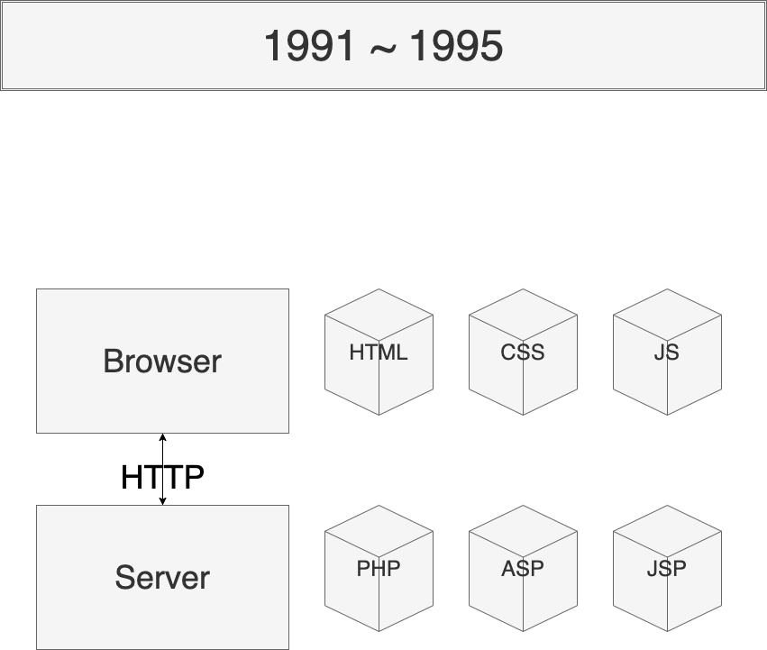

# Web技術における標準化の歴史 {#history-of-Web-standardization}
## 1960年〜1995年 {#1960-1995}

Webの始まりは、1960年代からとなる。
[インターネット](https://en.wikipedia.org/wiki/History_of_the_Internet)の誕生だ。
インターネットにより、世界中のネットワークが相互接続されることになる。
その結果、HTMLなどのハイパーテキストが世界中でつながるようになり、Webという基盤が誕生する。

[1991年、HTMLが誕生](https://en.wikipedia.org/wiki/HTML)する。
当時のWebは、WebサーバからHTMLをHTTP通信で返却するだけの構成だった。

[1993年、Common Gate Interface（CGI）が誕生](https://en.wikipedia.org/wiki/Common_Gateway_Interface)する。
CGIにより、ブラウザの要求をソフトウェアで処理できるようになった。
結果、純粋にHTMLを返却していたところが、動的に処理したHTMLを返却できるようになり、より高度なコンテンツの提供が可能となる。
CGIでもっとも普及したのが、PHPだ。

[1994年、CSSが誕生](https://en.wikipedia.org/wiki/CSS#Difficulty_with_adoption)した。
1994年以前は、ドキュメントのレイアウトは実現できていたが、ドキュメントの構造とレイアウトを分離できていなかった。
[カスケードスタイルであるCSS](https://developer.mozilla.org/en-US/docs/Web/CSS/Cascade)を使い、その問題を解消した。

[1995年、Javascript（旧：LiveScript）が誕生](https://en.wikipedia.org/wiki/JavaScript)した。
Javascriptにより、ブラウザはHTMLをロードするだけから、動作まで付与できるようになった。
NetscapeとMicrosoftによる[ブラウザ戦争](https://en.wikipedia.org/wiki/Browser_war)が勃発した。

## 2002年 {#2002}

[2002年、XMLHttpRequestが誕生](https://en.wikipedia.org/wiki/XMLHttpRequest)した。
XMLHttpRequestにより、ブラウザからサーバへデータの要求を行えるようになった。
通信するためのAPI（Application Programming Interface）として、次の2つが提案された。

* SOAP（Simple Object Access Protocol）
* REST（REpresentational State Transfer）

SOAPは、WS-*と呼ばれるプロトコルの複雑さがあったため、評判が悪かった。
SOAPに比べてRESTは、シンプルな設計であったため、APIの主流となった。

## 2005年 {#2005}

[2005年、Ajaxが誕生](https://en.wikipedia.org/wiki/Ajax_%28programming%29)した。
Ajax（Asynchronous JavaScript And XML）は、その名のとおりJavascriptから非同期にXMLデータの送受信を行うことだ。
その送受信に、XMLHttpRequestが使用される。
Ajaxの登場により、ブラウザをリロードせずにアプリケーションを動かす、SPA（Single Page Application）の開発が可能となった。
