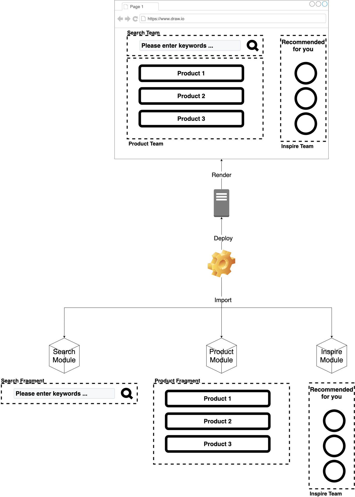

# マイクロフロントエンドの組成パターン {#composite-pattern-of-micro-frontends}

本章では、実際にマイクロフロントエンドを構築する際の組成パターンについて紹介する。

## 前提 {#premise}

1つのECサイトを3つのチームでアプリケーション開発する想定とする。

* Search Team
  * Productを検索する
* Product Team
  * Productを魅せる
* Inspire Team
  * Productへの購買意欲を高める

これらのチームは、バックエンドからフロントエンドまで1チームで構成されている。
フロントエンドは、コンテンツ（HTML,CSS,JS）を提供する。

## Client-side組成パターン {#client-side-composition}

クライアントサイドレンダリングするタイミングで、組成する。
一番わかりやすい例が、iframeやWeb Componentsである。
各フロントエンドチームのコンテンツを、ブラウザ上で組成する。
もっとも簡単な手段は、iframeによる読み込みだ。

## Server-side組成パターン {#server-side-composition}

サーバーサイドレンダリングのタイミングで、組成する。
一番わかりやすい例が、SSIである。
各フロントエンドチームのコンテンツを、サーバーサイドで組成する。

## Build-time組成パターン {#build-time-composition}

アプリケーションのビルドするタイミングで、組成する。
一番わかりやすい例が、[bit.dev](https://bit.dev/)のようなサービスである。
各フロントエンドチームがnpm moduleを開発する。
そのmoduleには、コンテンツ（HTML,CSS,JS）を提供する機能を含める。
フロントエンドアプリケーションは、各フロントエンドチームのmoduleをインポートして利用する。

